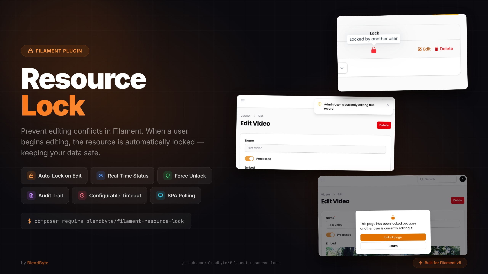

<a target="_blank" href="https://github.com/blendbyte/filament-resource-lock/filament-resource-lock-marketing.jpg" class="filament-hidden">

</a>


# Resource Lock

[](https://packagist.org/packages/blendbyte/filament-resource-lock)
[](https://github.com/blendbyte/filament-resource-lock/actions/workflows/tests.yml)
[](https://github.com/blendbyte/filament-resource-lock/actions/workflows/static-analysis.yml)
[](LICENSE.md)

Filament Resource Lock is a Filament plugin that adds resource locking functionality to your site. When a user begins editing a resource, it is automatically locked to prevent other users from editing it at the same time. The resource will be automatically unlocked after a set period of time, or when the user saves or discards their changes.

> **Note:** This package is a fork of [kenepa/resource-lock](https://github.com/kenepa/resource-lock), updated for **Filament v5** compatibility. If you are currently using `kenepa/resource-lock`, see the [migration guide](#migrating-from-keneparesource-lock) below.

## Migrating from kenepa/resource-lock

This fork introduces the following breaking changes:

1. **Composer package** — replace `kenepa/resource-lock` with `blendbyte/filament-resource-lock`

2. **PHP namespace** — find and replace `Kenepa\ResourceLock` with `Blendbyte\FilamentResourceLock` across your application

3. **Config file** — the config was renamed from `resource-lock.php` to `filament-resource-lock.php`. Re-publish if you have a customised config:
   ```bash
   php artisan vendor:publish --tag="filament-resource-lock-config" --force
   ```

4. **Artisan commands** — command signatures changed from `resource-lock:*` to `filament-resource-lock:*` (e.g. `filament-resource-lock:install`)

5. **Filament version** — this package requires **Filament v5**. The original `kenepa/resource-lock` targets Filament v3/v4.

Quick steps:

```bash
composer remove kenepa/resource-lock
composer require blendbyte/filament-resource-lock
php artisan filament-resource-lock:install
```

Then update all `use Kenepa\ResourceLock\...` import statements to `use Blendbyte\FilamentResourceLock\...`.

## Installation

```bash
composer require blendbyte/filament-resource-lock
```

Then run the installation command to publish and run the migration:

```bash
php artisan filament-resource-lock:install
```

Register the plugin with a panel:

```php
use Blendbyte\FilamentResourceLock\ResourceLockPlugin;
use Filament\Panel;

public function panel(Panel $panel): Panel
{
    return $panel
        // ...
        ->plugin(ResourceLockPlugin::make());
}
```

## Usage

### Add Locks to your model

Add the `HasLocks` trait to the model you want to lock:

```php
use Blendbyte\FilamentResourceLock\Models\Concerns\HasLocks;

class Post extends Model
{
    use HasFactory;
    use HasLocks;
}
```

### Add Locks to your EditRecord page

Add the `UsesResourceLock` trait to your `EditRecord` page:

```php
use Blendbyte\FilamentResourceLock\Resources\Pages\Concerns\UsesResourceLock;

class EditPost extends EditRecord
{
    use UsesResourceLock;

    protected static string $resource = PostResource::class;
}
```

### Simple modal resource

For simple modal resources, use `UsesSimpleResourceLock` instead:

```php
use Blendbyte\FilamentResourceLock\Resources\Pages\Concerns\UsesSimpleResourceLock;

class ManagePosts extends ManageRecords
{
    use UsesSimpleResourceLock;

    protected static string $resource = PostResource::class;
}
```

### Relation manager locking

To lock related records when editing them via a relation manager, add `UsesRelationManagerResourceLock` to your relation manager class. The related model also needs the `HasLocks` trait.

```php
use Blendbyte\FilamentResourceLock\Resources\Pages\Concerns\UsesRelationManagerResourceLock;

class PostCommentsRelationManager extends RelationManager
{
    use UsesRelationManagerResourceLock;

    protected static string $relationship = 'comments';
}
```

When a user opens the edit modal for a related record, it is locked for the duration of the edit session and released when the modal is closed.

### Table lock indicators

Add `ResourceLockColumn` to any resource table to display a visual lock status indicator for each row. It shows a lock icon in **primary** (blue) when the record is locked by the current user, or **danger** (red) when locked by another user. Unlocked records show no icon.

```php
use Blendbyte\FilamentResourceLock\Tables\Columns\ResourceLockColumn;

public static function table(Table $table): Table
{
    return $table
        ->columns([
            ResourceLockColumn::make(),
            // other columns...
        ]);
}
```

Add the `WithResourceLockIndicator` trait to the corresponding `ListRecords` page to eager-load the lock relationship and avoid N+1 queries:

```php
use Blendbyte\FilamentResourceLock\Resources\Pages\Concerns\WithResourceLockIndicator;

class ListPosts extends ListRecords
{
    use WithResourceLockIndicator;

    protected static string $resource = PostResource::class;
}
```

When `shouldDisplayResourceLockOwner()` is enabled on the plugin, the column tooltip will display the lock owner's name (e.g. *"Locked by John Doe"*). Otherwise it falls back to *"Locked by another user"*.

## Polling (SPA mode)

To support SPA mode, enable polling-based presence detection in the plugin:

```php
->plugin(ResourceLockPlugin::make()
    ->usesPollingToDetectPresence()
    ->presencePollingInterval(10)
    ->lockTimeout(15)
)
```

> **Tip:** Make sure the lock timeout is not lower than the polling interval — otherwise the lock may expire before the next heartbeat is sent.

Additional polling options:
- **`pollingKeepAlive()`**: Keeps polling alive when the tab is in the background.
- **`pollingVisible()`**: Only polls when the browser tab is visible.

## Resource Lock Manager

The package includes a UI to view and manage all active and expired locks, and to unlock resources individually or in bulk.

## Laravel Events

The package dispatches Laravel events for every lock lifecycle transition. Events are **enabled by default** and can be consumed by any standard Laravel listener.

| Event | Payload |
|---|---|
| `ResourceLocked` | `$lockable`, `$userId` |
| `ResourceUnlocked` | `$lockable`, `$userId` |
| `ResourceLockExpired` | `$lockable`, `$originalUserId` |
| `ResourceLockForceUnlocked` | `$lockable`, `$originalUserId`, `$actorUserId` |

Register a listener in your `AppServiceProvider` or `EventServiceProvider`:

```php
use Blendbyte\FilamentResourceLock\Events\ResourceLocked;
use Blendbyte\FilamentResourceLock\Events\ResourceUnlocked;
use Blendbyte\FilamentResourceLock\Events\ResourceLockForceUnlocked;

Event::listen(ResourceLocked::class, function (ResourceLocked $event) {
    // $event->lockable — the model that was locked
    // $event->userId   — the user who acquired the lock
});
```

To disable all event dispatching:

```php
// config/filament-resource-lock.php
'events' => [
    'enabled' => false,
],
```

Or via the plugin fluent API:

```php
->plugin(ResourceLockPlugin::make()
    ->enableEvents(false)
)
```

## Audit Trail

The audit trail records every lock lifecycle event to a `resource_lock_audit` table, giving you a permanent, queryable history of who locked what and when.

Audit logging is **opt-in** (`audit.enabled` defaults to `false`) and requires `events.enabled` to be `true`, as it is powered by the event system.

### Enabling the audit trail

Publish and run the migration (if not already done via `filament-resource-lock:install`):

```bash
php artisan vendor:publish --tag="filament-resource-lock-migrations"
php artisan migrate
```

Enable audit logging in your config:

```php
// config/filament-resource-lock.php
'audit' => [
    'enabled' => true,
],
```

Or via the plugin fluent API:

```php
->plugin(ResourceLockPlugin::make()
    ->enableAudit()
)
```

### Audit Resource

When `audit.enabled` is `true`, a read-only **Lock Audit Log** resource becomes visible in your Filament panel. It displays all recorded events with a colour-coded action badge, filterable by action type and date range.

The audit resource navigation can be customised independently of the lock manager:

```php
->plugin(ResourceLockPlugin::make()
    ->enableAudit()
    ->auditNavigationLabel('Lock History')
    ->auditNavigationIcon('heroicon-o-clock')
    ->auditNavigationGroup('Security')
    ->auditNavigationSort(3)
)
```

To enable audit logging but hide the built-in resource (e.g. you have a custom UI):

```php
// config/filament-resource-lock.php
'audit' => [
    'enabled' => true,
    'should_register_navigation' => false,
],
```

## Configuration

### Read-only mode

By default, when a user opens a resource that is locked by someone else, a blocking modal is shown. Enable read-only mode to show a warning banner instead, while keeping the page accessible for viewing:

```php
->plugin(ResourceLockPlugin::make()
    ->readOnlyWhenLocked()
)
```

When read-only mode is active:
- All form fields are disabled.
- Save, cancel, and delete actions are hidden.
- A persistent warning banner is displayed, optionally showing the lock owner's name when `shouldDisplayResourceLockOwner()` is enabled.
- If the user has permission to force-unlock, they can do so from the banner and immediately take over editing.

Or configure it via the config file:

```php
// config/filament-resource-lock.php
'read_only_mode' => [
    'enabled' => true,
],
```

### Per-model lock timeout

Declare a `$lockTimeout` property (in seconds) on any model using `HasLocks` to override the global default for that model:

```php
use Blendbyte\FilamentResourceLock\Models\Concerns\HasLocks;

class Post extends Model
{
    use HasLocks;

    protected int $lockTimeout = 30; // seconds, overrides the global default
}
```

The global default (`lock_timeout` in config, or `->lockTimeout()` on the plugin) is used for all models that do not declare their own property.

### Access control

Restrict access to the Unlock button or resource manager using a gate or Spatie permission:

```php
->plugin(ResourceLockPlugin::make()
    ->limitedAccessToResourceLockManager()
    ->gate('unlock')
)
```

### Custom models

```php
->plugin(ResourceLockPlugin::make()
    ->userModel(\App\Models\CustomUser::class)
    ->resourceLockModel(\App\Models\CustomResourceLock::class)
)
```

### Custom lock owner display

Create a custom action class extending `GetResourceLockOwnerAction`:

```php
namespace App\Actions;

use Blendbyte\FilamentResourceLock\Actions\GetResourceLockOwnerAction;

class CustomResourceLockOwnerAction extends GetResourceLockOwnerAction
{
    public function execute($userModel): string|null
    {
        return $userModel->email;
    }
}
```

Register it in the plugin:

```php
->plugin(ResourceLockPlugin::make()
    ->resourceLockOwnerAction(\App\Actions\CustomResourceLockOwnerAction::class)
)
```

### Overriding default functionality

Override `resourceLockReturnUrl()` to change where the Return button redirects:

```php
public function resourceLockReturnUrl(): string
{
    return route('dashboard');
}
```

## Scheduled auto-clear

The package automatically registers a scheduled task that runs `filament-resource-lock:clear-expired --force` **every hour**. This is enabled by default (opt-out).

To disable it and manage the schedule yourself:

```php
// config/filament-resource-lock.php
'schedule' => [
    'auto_clear_expired' => false,
],
```

Then register it manually with whatever frequency suits your app:

```php
// app/Console/Kernel.php  (or a ServiceProvider using Schedule)
$schedule->command('filament-resource-lock:clear-expired --force')->everyThirtyMinutes();
```

> **Note:** Laravel's scheduler requires a cron entry on your server: `* * * * * php /path/to/artisan schedule:run >> /dev/null 2>&1`

## Publishing assets

```bash
# Migrations
php artisan vendor:publish --tag="filament-resource-lock-migrations"
php artisan migrate

# Views
php artisan vendor:publish --tag="filament-resource-lock-views"
```

## Contributing

Please see [GitHub releases](https://github.com/blendbyte/filament-resource-lock/releases) for changelog information.

## License

The MIT License (MIT). Please see [License File](LICENSE.md) for more information.
